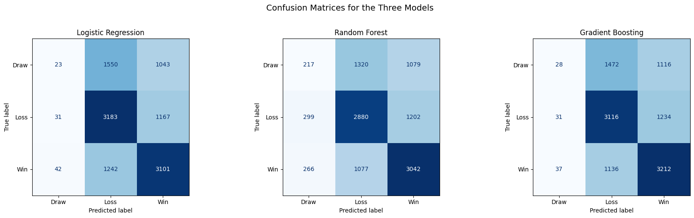
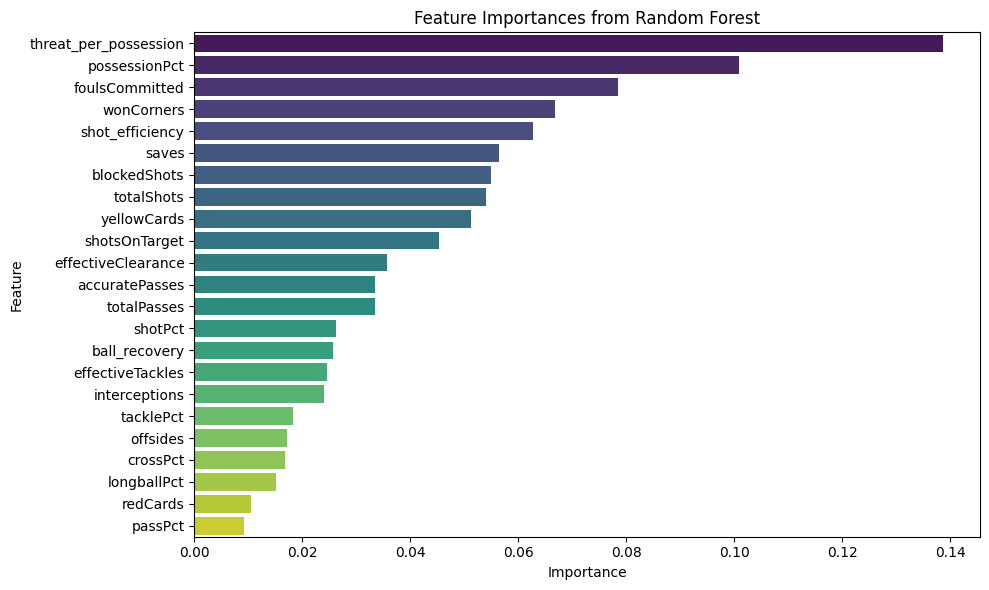

# Soccer Match Outcome Prediction
### Sports Analytics | Machine Learning | Feature Engineering | Classification Models | Python

## Executive Summary
Predicting soccer match outcomes has always been a complex challenge in sports analytics - the sport's low scoring and high-variant nature make outcomes difficult to model. 

Exploring ESPN Soccer Dataset match and team statitics, through feature engineering for proxy metrics of complex metrics, such as Expected Goals (xG), the analyis develops classification models to predict match outcomes.

All three models converge at similar ceiling accuracy levels of 56% - concluding performance of models are data-driven and the data on hand lack positional and complex nature that determines match outcomes.

## Business Problem
Sports organizations, teams, game-coverage broadcasters, and betting sectors invest heavily in match outcome prediction. Tradtional raw statistics like total shots and possesion are widely available but fail to capture meaningful insight a team's attacking threat. Without event specific data, and developing prediction models from raw statistics alone limits reliability.

**Aim:** Which engineered proxy metric for granular event-level data improve match outcome predictions beyond basic raw statistics?

## Methodology
1. Data Merging & Cleaning - Merged team statistics and fixture results across ESPN dataset tables
2. Feature Engineering - Engineered proxy metrics as possible substitutes for unavailable xG data:
   - `threat_per_possession` — attacking threat generated per possession
   - `shot_efficiency` — shots on target as a proportion of total shots
3. Modeling - Develop and Evaluated three classification models:
   - Logistic Regression
   - Random Forest
   - Gradient Boosting
4. Feature Importance - Identified most influential drivers of match outcome

## Results & Business Recommendation

### Key Findings
- All three models converge at **~55-56% accuracy** — marginally above random 
  baseline for a 3-class problem (33%)
    
- `threat_per_possession` ranked as the **top predictive feature** across all 
  models — validating the proxy metric approach
- `shot_efficiency` also ranked in the top 5 — confirming shot quality matters 
  more than shot volume
  
- Performance ceiling is data-driven not model-driven — Gradient Boosting 
  and Random Forest offer no meaningful improvement over Logistic Regression, 
  suggesting the limiting factor is feature quality not model complexity

### Recommendation
**Stakeholder:** Sports analytics teams and performance analysts

Invest in event-level data collection — shot location, pass networks, and 
pressing intensity are the features needed to meaningfully improve prediction 
accuracy beyond 56%. Aggregated team statistics alone are insufficient for 
reliable match outcome prediction.

The engineered proxy metrics show predictive potential and should be retained in any future modeling effort with the ability to improve on them with richer data.

## Skills & Tools
| Category | Details |
|----------|---------|
| **Language** | Python |
| **Libraries** | Pandas, NumPy, Scikit-learn, Matplotlib, Seaborn |
| **ML Methods** | Logistic Regression, Random Forest, Gradient Boosting, Cross-validation |
| **Concepts** | Feature engineering, proxy metrics, multi-class classification, model comparison |

## Next steps & Limitations
- No event-level positional data —  Implementation of StatsBomb or Opta data would provide shot location, angle, pass networks, etc. - granular data to improve model reliability
- Dataset covers a single season limiting longitudinal trend analysis
- Home/Away splits could impact model prediction - seperate models needed

## Dataset
[ESPN Soccer Data — Kaggle](https://www.kaggle.com/datasets/excel4soccer/espn-soccer-data)

### Notebook
`soccer_analysis.ipynb` — Full analysis notebook

